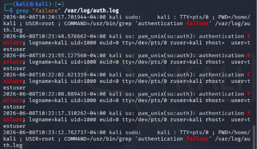
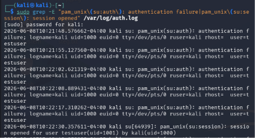
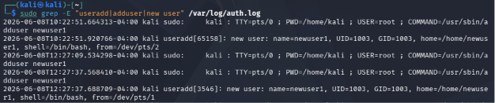

# Week 2 — Detection Engineering GitHub Evidence

## Overview

This repository contains the GitHub evidence for the Week 2 detection engineering task. The activity was completed using Kali Linux authentication logs from `/var/log/auth.log`. The detections were created using Linux command-line tools and screenshots are included as evidence.

---

## Detection 1 — Failed Authentication Attempts

### Detection Command

    sudo grep "authentication failure" /var/log/auth.log

### Screenshot Evidence

### Documentation

This detection identifies repeated failed authentication attempts in the Linux authentication log. The screenshot shows multiple `pam_unix(su:auth): authentication failure` entries. These entries show failed attempts to authenticate using `su`.

This command is useful because repeated failed authentication attempts may indicate password guessing or brute-force behavior. If many failures happen close together, it can suggest that someone is repeatedly trying different passwords to gain access.

---

## Detection 2 — Successful Login After Failures

### Detection Command

    sudo grep -E "pam_unix\(su:auth\): authentication failure|pam_unix\(su:session\): session opened" /var/log/auth.log

### Screenshot Evidence

### Documentation

This detection identifies a successful authentication session after previous failed authentication attempts. The screenshot shows failed `su` authentication attempts followed by a successful session opened for the root user.

This command is useful because a successful login or session after repeated failures may indicate that the correct password was eventually guessed or obtained.

---

## Detection 3 — New User Creation

### Detection Command

    sudo grep -E "useradd|adduser|new user" /var/log/auth.log

### Screenshot Evidence

### Documentation

This detection identifies local user account creation. The screenshot shows the `adduser` command being executed and a new user account named `newuser1` being created.

This command is useful because new local account creation can be important evidence in an investigation. If performed by an attacker, it may show an attempt to maintain access to the system.

---

## Evidence Summary

The screenshots provide evidence for all three required detections:

1. Failed authentication attempts  
2. Successful login after failures  
3. New user creation  

These commands show how Linux authentication logs can be searched to identify suspicious activity.
