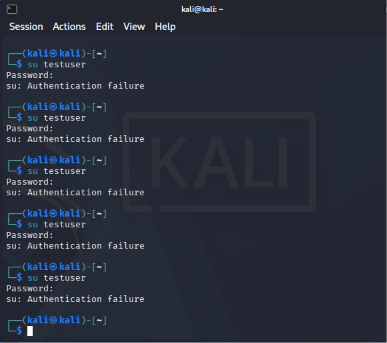
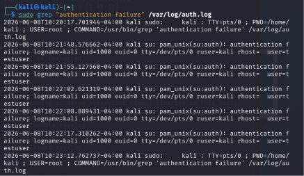
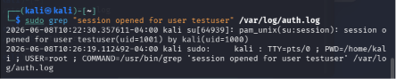
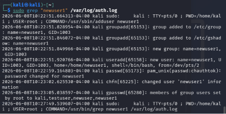
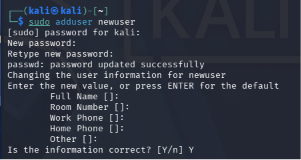

# Week 2 Log Analysis and Security Investigation

## Overview

This folder contains my Week 2 log analysis investigation. The purpose of this task was to generate Linux authentication activity, analyze `/var/log/auth.log`, extract relevant evidence using `grep`, and reconstruct a timeline of events.

The investigation included failed `su` login attempts, one successful `su` login, new user account creation, log extraction using `grep`, timeline reconstruction, and evidence screenshots.

---

## Investigation Environment

- Operating System: Kali Linux
- Log source: `/var/log/auth.log`
- Authentication method tested: `su`
- Main analysis command: `grep`

---

## Commands Used

    su testuser
    whoami
    exit
    sudo adduser newuser1
    sudo grep "authentication failure" /var/log/auth.log
    sudo grep "session opened for user testuser" /var/log/auth.log
    sudo grep "newuser1" /var/log/auth.log

---

## Evidence Screenshots

### Failed `su` Login Attempts

This screenshot shows the failed `su` login activity. Multiple failed login attempts were generated to simulate possible password guessing behavior.

---

### Extracted Failed Login Evidence Using `grep`

This screenshot shows log evidence extracted from `/var/log/auth.log` using the `grep` command. The output includes authentication failure entries related to the failed `su` attempts.

---

### Successful `su` Login Evidence

This screenshot shows evidence of a successful `su` session. The log entry confirms that a session was opened for the user `testuser`.

---

### Password/Login Activity

This screenshot shows password or login-related terminal activity during the investigation.

---

### User-Related Log Evidence

This screenshot shows user-related log entries found during the investigation.

---

### New User Account Creation Evidence

This screenshot shows evidence related to the creation of the new user account `newuser1`.

---

## Extracted Evidence

## Failed Login Evidence

Failed login attempts were extracted using this command:

    sudo grep "authentication failure" /var/log/auth.log

The log entries showed multiple authentication failures for the `su` command. These entries are important because repeated failed login attempts may suggest password guessing or brute-force behavior in a real investigation.

## Successful Login Evidence

Successful login activity was extracted using this command:

    sudo grep "session opened for user testuser" /var/log/auth.log

The log evidence showed that a session was opened for the user `testuser`. This confirms that a successful `su` login occurred after the failed attempts.

## New User Creation Evidence

New user creation activity was extracted using this command:

    sudo grep "newuser1" /var/log/auth.log

The log entries showed that the user `newuser1` was created. The evidence included user and group creation activity, as well as password setup. In a real investigation, new user creation can be important because attackers may create accounts to maintain access to a system.

---

## Timeline Reconstruction

| Timestamp | Event | Investigation Meaning |
|---|---|---|
| 2026-06-08 10:21:48 | Failed `su` login attempt | Possible password guessing attempt |
| 2026-06-08 10:21:55 | Failed `su` login attempt | Repeated authentication failure |
| 2026-06-08 10:22:02 | Failed `su` login attempt | Continued failed login activity |
| 2026-06-08 10:22:08 | Failed `su` login attempt | Possible brute-force behavior |
| 2026-06-08 10:22:17 | Failed `su` login attempt | Repeated failed access attempt |
| 2026-06-08 10:26:19 | Successful `su` login for `testuser` | Valid access occurred after failed attempts |
| 2026-06-08 10:22:51 | New user `newuser1` created | New account creation activity; could indicate persistence in a real incident |

---

## Investigation Summary

During this investigation, I generated authentication activity on a Linux machine and analyzed the related log entries in `/var/log/auth.log`. I performed failed `su` login attempts, completed one successful `su` login, and created a new user account named `newuser1`.

I used `grep` to filter the log file and extract relevant entries. This made it easier to find failed authentication attempts, successful login activity, and user creation evidence without manually reviewing the entire log file.

The failed login attempts are important because repeated failures can indicate password guessing. The successful login is important because it shows that access was eventually granted. The new user creation event is also significant because attackers may create new accounts to maintain access after gaining entry.

---

## Key Findings

- Failed `su` login attempts were recorded in `/var/log/auth.log`.
- A successful `su` session was recorded for the user `testuser`.
- A new user account named `newuser1` was created.
- `grep` helped extract relevant evidence quickly.
- Timeline reconstruction helped connect separate log entries into a clear investigation story.

---

## Lessons Learned

This exercise showed how logs support digital investigations. I learned that raw log entries can become useful evidence when they are preserved, filtered, and analyzed properly. I also learned that one event alone may not always prove malicious activity, but a sequence of events can reveal a suspicious pattern.

Repeated failed logins followed by successful access can suggest password guessing or credential compromise. New user account creation can also be suspicious because it may indicate persistence. Overall, this task helped me understand how DFIR and SOC analysts use logs to reconstruct activity and identify possible security incidents.
